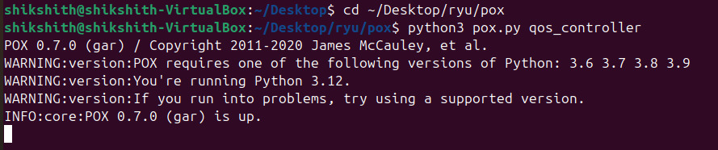
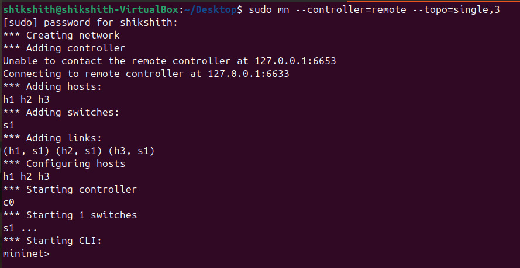
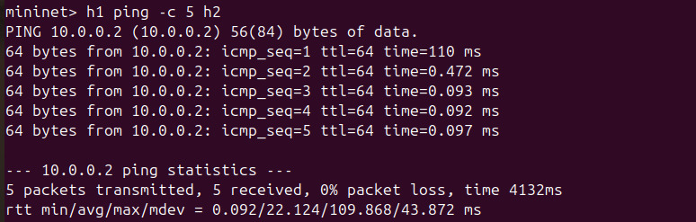
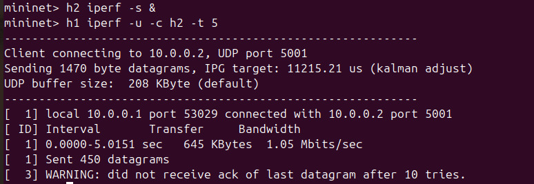
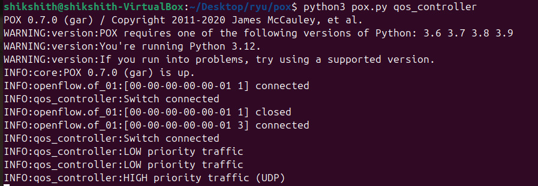
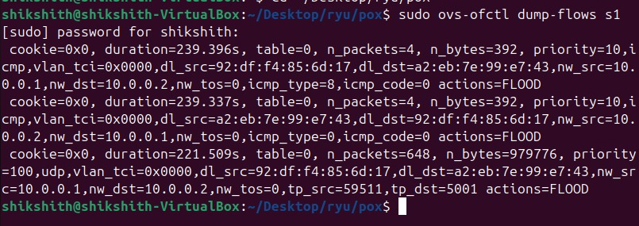

# Simple QoS Priority Controller using SDN (Mininet + POX)

## Problem Statement

The objective of this project is to implement a Software Defined Networking (SDN) solution using Mininet and an OpenFlow controller to demonstrate Quality of Service (QoS). The controller classifies network traffic and assigns different priorities to improve performance for important traffic.

---

## Setup / Execution Steps

### Step 1: Start POX Controller

```bash
cd pox
python3 pox.py qos_controller
```

### Step 2: Start Mininet

```bash
sudo mn --controller=remote --topo=single,3
```

---

## Testing Commands

### Low Priority Traffic (ICMP)

```bash
h1 ping -c 5 h2
```

### High Priority Traffic (UDP)

```bash
h2 iperf -s
h1 iperf -u -c h2 -t 5
```

---

## Expected Output

* The Mininet topology should start successfully with 3 hosts and 1 switch.
* Ping test should work with slight delay (low priority traffic).
* UDP traffic using iperf should show better performance (high priority).
* The controller terminal should display logs indicating:

  * High priority traffic (UDP)
  * Low priority traffic (other protocols)

This demonstrates that the controller is correctly applying QoS by prioritizing UDP traffic over other types.

## Proof of Execution

### Controller Start


### Mininet Topology


### Ping Test (Low Priority Traffic)


### Iperf Test (High Priority Traffic)


### Controller Logs


### Flow Table Entries

The flow table in the switch shows installed rules:


